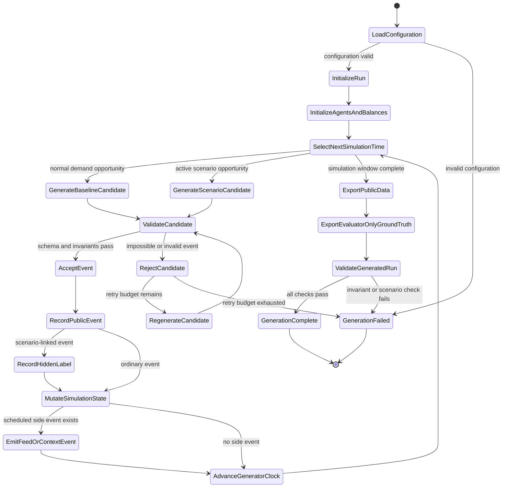
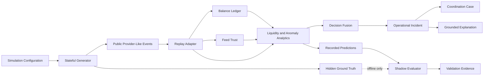

# Data and Simulation Methodology

## Super Agent Liquidity & Risk Intelligence Platform

**Document purpose:** Explain how the prototype’s synthetic multi-provider data is created, how liquidity, anomaly, context, and data-quality scenarios are represented, how hidden ground truth is separated from operational inputs, and what assumptions and limitations apply.

---

## 1. Executive summary

The prototype uses a deterministic, stateful synthetic simulation of multi-provider mobile financial service agent operations. Each simulated agent has:

- one shared physical-cash pool,
- one separate e-money balance for each provider,
- provider-specific transaction activity,
- provider feed-health events,
- local operational context,
- and a traceable timeline of liquidity and unusual-activity conditions.

The simulation is designed to answer the same operational questions as the live prototype:

1. What is the agent’s current shared-cash position?
2. What is the current balance for each provider?
3. Which resource may face pressure next, and approximately when?
4. Is the observed behaviour ordinary demand, a data-quality problem, or activity requiring human review?
5. Can the alert be routed, owned, acknowledged, escalated, and resolved safely?

The generator does not write unrelated random CSV rows. It advances through a synthetic operating day while maintaining valid financial state. Every accepted transaction affects the balances available to later transactions. Scenario-linked events are written in the same public format as normal events, while scenario labels are stored separately for offline evaluation.

The current baseline run is identified as:

```text
run_id: DEMO-DAY-V2
seed:   20260711
```

Given the same source code, configuration, and seed, the generated dataset is reproducible.

---

## 2. Why synthetic data is used

The prototype deliberately uses synthetic data because the problem can be demonstrated and evaluated without connecting to production providers or exposing real customer information.

Synthetic generation provides several advantages:

- no real customer names, phone numbers, balances, or transaction accounts,
- no production provider API dependency,
- no PIN, OTP, password, private key, or authentication credential,
- repeatable scenarios for testing and presentation,
- known ground truth for precision, recall, and false-positive measurement,
- controlled feed delays, conflicts, and recovery events,
- and a safe environment for testing human-review workflows.

The dataset is intended to be operationally plausible for a prototype. It is not presented as a statistically representative sample of any provider’s production network.

---

## 3. Simulation scope

### 3.1 Simulated actors and entities

The simulation represents:

| Entity | Purpose |
|---|---|
| Agent | A multi-provider outlet serving customers through several providers |
| Provider | A logically separate financial service context such as bKash, Nagad, or Rocket |
| Area | A synthetic operating area used for filtering and prioritization |
| Synthetic account | A non-real identifier used to create transaction diversity and concentration patterns |
| Shared physical cash | The agent’s single physical cash reserve used across providers |
| Provider e-money | A separate electronic balance maintained for each provider |
| Transaction | A cash-in or cash-out request with amount, time, status, provider, agent, and synthetic account |
| Feed event | A heartbeat, delayed feed, recovery, or balance-checkpoint event |
| Context event | A local operating condition such as a legitimate Eid demand period |
| Scenario label | Evaluator-only ground truth describing intentionally injected behaviour |

### 3.2 Provider separation

The simulation treats providers as logically separate systems.

For every agent:

```text
one shared physical-cash balance
+
one bKash e-money balance
+
one Nagad e-money balance
+
one Rocket e-money balance
```

The balances are visible together for operational understanding, but they are never merged into one interchangeable wallet.

The simulation does not model:

- conversion between provider balances,
- provider-to-provider settlement,
- automatic wallet refill,
- unauthorized cash movement,
- or real provider control.

---

## 4. Public and evaluator-only datasets

The simulation produces two physically separate groups of files.

### 4.1 Public operational data

These files are consumed by the replay adapter and analytical engines:

```text
data/synthetic_v2/
├── agents.csv
├── opening_balances.csv
├── transactions.csv
├── feed_events.csv
└── context_events.csv
```

Typical public fields include:

```text
transaction_id
timestamp
agent_id
provider_id
account_id
transaction_type
amount
status
area
opening_shared_cash
opening_provider_balance
feed_event_type
reported_balance
context_type
```

The exact schema is defined by the project’s canonical event models.

### 4.2 Evaluator-only ground truth

These files are used only after replay for validation:

```text
data/ground_truth_v2/
├── scenario_labels.csv
├── transaction_failures.csv
└── scenario_manifest.json
```

Evaluator-only fields may include:

```text
scenario_id
scenario_type
expected_agent_id
expected_provider_id
scenario_start
scenario_end
linked_transaction_id
expected_detection
expected_review_outcome
```

### 4.3 Ground-truth isolation rule

The analytical pipeline never receives `scenario_id` or scenario labels.

The live engines see only operational evidence such as:

- agent,
- provider,
- timestamp,
- amount,
- transaction type,
- account identifier,
- status,
- feed age,
- balance checkpoint,
- and local context.

Hidden labels are loaded only by the offline validator after the engine has generated its forecasts, anomaly assessments, incidents, and cases.

This separation prevents answer leakage and makes the evaluation meaningful.

---

## 5. Financial state model

### 5.1 Opening state

Each agent begins the simulated day with:

- one opening shared-cash amount,
- one opening e-money amount per provider,
- initial feed-health state,
- and no derived incidents or coordination cases.

Opening balances are the starting point for replay. Current balances are derived by processing accepted transactions in timestamp order.

### 5.2 Cash-in and cash-out effects

The prototype uses the following simplified operational accounting model.

#### Cash-in

A customer gives physical cash to the agent and receives provider e-money.

```text
shared physical cash increases
provider e-money decreases
```

#### Cash-out

A customer transfers provider e-money and receives physical cash from the agent.

```text
shared physical cash decreases
provider e-money increases
```

### 5.3 Failed transactions

A failed transaction remains part of the event stream for behavioural and reliability analysis, but it does not mutate financial balances.

### 5.4 Financial invariants

The generator and validator check that:

- accepted transactions reference valid agents and providers,
- transaction IDs are unique,
- timestamps are valid and ordered,
- successful transactions apply the expected balance delta,
- failed transactions do not alter balances,
- provider balances remain provider-specific,
- shared cash remains agent-scoped,
- hidden labels do not appear in public files,
- and linked ground-truth references point to real generated events.

The simulation may intentionally approach or cross configured safety thresholds to demonstrate pressure, but it does not silently create unexplained financial state.

---

## 6. Deterministic, stateful generation

### 6.1 Fixed seed

The generator uses a fixed random seed.

```text
seed: 20260711
```

The seed controls stochastic choices such as:

- event timing,
- provider selection,
- transaction type,
- amount variation,
- account selection,
- success or failure outcome,
- and scenario candidate variation.

A fixed seed allows the team to:

- reproduce the same dataset,
- rehearse the same demo,
- reproduce bugs,
- compare code changes fairly,
- and regenerate validation evidence consistently.

Changing the seed creates a different but still deterministic run.

### 6.2 Why the generator is stateful

A simple random-row generator could produce many transactions quickly, but it could also create impossible or analytically weak data.

The stateful generator keeps track of:

- current shared cash,
- current provider balances,
- current simulation time,
- recent account usage,
- active scenario windows,
- feed heartbeat state,
- context state,
- accepted and rejected candidates,
- and scenario progress.

Therefore, each accepted event influences what can happen next.

---

## 7. Data-generation state machine



### State responsibilities

| State | Responsibility |
|---|---|
| `LoadConfiguration` | Parse the seed, time window, agents, providers, balances, and scenario parameters |
| `InitializeRun` | Create deterministic random sources and run metadata |
| `InitializeAgentsAndBalances` | Establish opening shared cash and separate provider balances |
| `SelectNextSimulationTime` | Advance through the day in chronological order |
| `GenerateBaselineCandidate` | Propose ordinary background activity |
| `GenerateScenarioCandidate` | Propose activity influenced by an active scenario |
| `ValidateCandidate` | Check schema, identifiers, provider scope, timing, and financial feasibility |
| `RejectCandidate` | Discard an invalid event before state mutation |
| `RegenerateCandidate` | Retry generation within a bounded budget |
| `RecordPublicEvent` | Write only the operational event visible to analytics |
| `RecordHiddenLabel` | Store evaluator-only scenario linkage separately |
| `MutateSimulationState` | Apply accepted financial and scenario state changes |
| `EmitFeedOrContextEvent` | Add heartbeat, delay, recovery, conflict, or local-context events |
| `ExportPublicData` | Finalize stable chronological operational files |
| `ExportEvaluatorOnlyGroundTruth` | Finalize hidden labels and expected scenario windows |
| `ValidateGeneratedRun` | Reject a run that violates invariants or expected scenario conditions |

---

## 8. Baseline transaction behaviour

Baseline activity creates the ordinary operating environment in which scenarios occur.

The generator varies behaviour by:

- agent,
- provider,
- time of day,
- transaction type,
- amount distribution,
- synthetic account diversity,
- success/failure probability,
- and local context.

The baseline is important because an injected scenario should not appear in an otherwise empty dataset. It must compete with normal activity in the same event stream.

### 8.1 Event timing

Transaction arrivals are generated throughout the configured operating day. Busy agents may receive more events, while lower-volume agents generate fewer.

### 8.2 Provider selection

Each agent may have different provider demand weights. This prevents all providers from receiving an identical share of activity.

### 8.3 Transaction type

The cash-in/cash-out mixture is varied so that some agents accumulate physical cash while others experience shared-cash pressure.

### 8.4 Amounts

Ordinary amounts are drawn from configurable distributions and ranges. Scenario generators may constrain amounts more tightly when creating repeated or near-identical behaviour.

### 8.5 Account diversity

Normal activity uses a broader synthetic account set. Concentration scenarios deliberately use a smaller recurring account group.

### 8.6 Status and failures

Most ordinary transactions succeed, while a controlled minority may fail. Failure outcomes support reliability and abnormal-failure analysis without changing financial state.

### 8.7 Time-of-day variation

The generator can create busier and quieter operating periods rather than using one flat rate across the entire day.

These parameters are prototype assumptions, not claims about any provider’s production distribution.

---

## 9. Scenario-injection methodology

Scenarios are not separate datasets or special analytical code paths. They are controlled interventions inside one continuous event stream.

The same liquidity, anomaly, data-trust, fusion, incident, and case engines process both normal and scenario-linked events.

### 9.1 Hidden provider shortage

**Purpose:** Demonstrate that a healthy aggregate view can hide a provider-specific e-money problem.

**Synthetic behaviour:**

- shared cash remains comparatively healthy,
- one provider starts with a more vulnerable e-money position,
- provider-specific cash-in demand consumes that e-money,
- the condition develops over time rather than appearing as a static label.

**Expected system behaviour:**

- provider forecast enters `WATCH` or `CRITICAL`,
- approximate time to safety threshold or depletion is shown,
- aggregate outlet state may appear healthier than the provider-specific state,
- the recommendation remains advisory.

**Possible normal explanation:** A temporary provider-specific demand imbalance.

---

### 9.2 Repeated cash-out cluster

**Purpose:** Demonstrate explainable unusual-activity detection.

**Synthetic behaviour:**

- increased cash-out velocity,
- several near-identical amounts,
- repeated activity from a small synthetic account set,
- a limited rolling time window.

**Expected system behaviour:**

- weighted factors such as velocity, amount similarity, and account concentration,
- `requires_human_review = true` when the configured evidence threshold is crossed,
- careful language that does not declare fraud,
- evidence and uncertainty shown to the reviewer.

**Possible normal explanation:** Merchant activity, salary-day demand, or legitimate repeated customer requests.

---

### 9.3 Legitimate Eid demand spike

**Purpose:** Act as a hard negative and test false-positive control.

**Synthetic behaviour:**

- higher transaction volume,
- broad account diversity,
- varied amounts,
- activity across one or more providers,
- an active local-context event.

**Expected system behaviour:**

- liquidity pressure may still be visible,
- unusual-activity review should not be triggered solely because volume is high,
- the context may classify the condition as legitimate demand,
- uncertainty remains visible where appropriate.

**Possible failure mode tested:** A detector that treats every volume spike as suspicious.

---

### 9.4 Feed delay and recovery

**Purpose:** Demonstrate safe behaviour when provider input becomes late or unavailable.

**Synthetic behaviour:**

- normal heartbeats are emitted initially,
- heartbeats are suppressed for a controlled interval,
- transactions may continue while confidence degrades,
- a recovery heartbeat is emitted later.

**Expected system behaviour:**

```text
HEALTHY → STALE → MISSING → HEALTHY
```

- forecast confidence decreases,
- strong recommendations may be disabled,
- a safe verification fallback is shown,
- recovery is recorded without erasing historical evidence.

**Possible normal explanation:** Temporary network or integration delay.

---

### 9.5 Balance conflict

**Purpose:** Test inconsistent provider information.

**Synthetic behaviour:**

- the replay ledger calculates one balance from accepted transactions,
- a simulated provider checkpoint reports a materially different balance,
- the conflict persists long enough to be observed.

**Expected system behaviour:**

- data-quality status becomes conflicting,
- the reported and calculated values remain visibly separate,
- confidence is reduced,
- the safe next step is verification rather than a strong liquidity action.

**Possible normal explanation:** Delayed reconciliation, checkpoint timing, or a temporary reporting issue.

---

### 9.6 Cross-provider linked activity

**Purpose:** Demonstrate provider-aware relationship insight without sharing raw confidential data.

**Synthetic behaviour:**

- a privacy-safe synthetic linked identifier appears across two provider contexts,
- related transactions occur within a controlled time window,
- timing, amount, or behavioural similarity creates a review signal.

**Expected system behaviour:**

- the core engine may identify related cross-provider context,
- provider-specific views receive only redacted information about the other provider,
- no provider is given control over another provider’s data or balance,
- human review is required.

**Possible normal explanation:** A shared merchant, household, or legitimate multi-provider customer pattern.

---

## 10. One continuous global event stream

All public transactions, feed events, and context events are normalized into canonical events and ordered by timestamp.

```text
all agents
+
all providers
+
transactions
+
feed events
+
context events
        ↓
global chronological event stream
```

The replay controller processes this stream using a deterministic simulation clock.

The frontend can:

- reset the day,
- advance by a selected number of minutes,
- play or pause replay,
- and observe derived state changing over time.

Resetting the replay does not regenerate the dataset. It restores the opening state and reprocesses the same event stream.

---

## 11. Replay and offline validation use the same core engine

The same canonical pipeline supports two modes.

### 11.1 Live replay mode

Used by the frontend to demonstrate:

- changing balances,
- forecast transitions,
- feed-health changes,
- anomaly evidence,
- incident creation,
- and case coordination.

### 11.2 Offline shadow-validation mode

Processes the full day without UI interaction and records:

- first detection time,
- maximum severity,
- anomaly outcome,
- liquidity outcome,
- data-quality outcome,
- incident creation,
- case creation,
- processing latency,
- and explanation coverage.

After predictions are recorded, the evaluator loads hidden ground truth and calculates metrics.

This design avoids maintaining one “demo engine” and a different “evaluation engine.”

---

## 12. Validation performed on generated data

Before a run is accepted, generation and replay validation check several categories.

### 12.1 Public-data integrity

- required files exist,
- rows match canonical schemas,
- transaction IDs are unique,
- timestamps are valid,
- events are chronologically sortable,
- provider and agent references are valid.

### 12.2 Financial integrity

- opening balances are valid,
- successful transaction deltas are consistent,
- failed transactions do not mutate balances,
- shared cash remains separate from provider e-money,
- provider-specific state is not merged.

### 12.3 Ground-truth integrity

- no hidden scenario field appears in public files,
- every labelled transaction exists,
- scenario windows reference valid agents and providers,
- expected scenario evidence is present.

### 12.4 Analytical validation

The offline evaluator may measure:

- anomaly precision,
- anomaly recall,
- hard-negative false-positive rate,
- liquidity detection coverage,
- shortage lead time,
- data-quality detection coverage,
- incident explanation coverage,
- incident-to-case coverage,
- average event-processing latency,
- and percentile processing latency.

All reported results must be labelled as measurements on the deterministic synthetic evaluation set, not as production accuracy.

---

## 13. Reproducibility and run management

A generated run is defined by:

```text
generator source version
+
configuration
+
seed
```

Changing any of these may change the output.

The dataset remains unchanged when the frontend:

- resets replay,
- advances time,
- pauses,
- resumes,
- or reopens an analytical view.

A new dataset is produced only when the generation script is run again.

### Example generation and validation workflow

```bash
python scripts/generate_simulation_v2.py
python scripts/validate_simulation_v2.py
pytest tests/unit/test_simulation_scenarios.py -v
pytest tests/integration/test_simulation_shadow_replay.py -v
```

The exact command-line arguments should be taken from:

```bash
python scripts/generate_simulation_v2.py --help
```

---

## 14. Assumptions

The prototype makes the following documented assumptions:

1. Each agent has one shared physical-cash pool.
2. Each agent has a separate e-money balance for each provider.
3. Provider balances cannot be converted or settled by the prototype.
4. Transaction events can be normalized into one canonical schema.
5. Successful cash-in and cash-out transactions produce deterministic balance deltas.
6. Failed transactions do not change balances.
7. Recent transaction flow is a useful prototype signal for near-term liquidity pressure.
8. Heartbeat age is a useful proxy for provider-feed trust.
9. A reported-versus-calculated balance difference is a data-quality signal, not proof of wrongdoing.
10. Repeated amounts and account concentration are review indicators, not fraud determinations.
11. Local context can help distinguish broad legitimate demand from concentrated unusual activity.
12. Synthetic cross-provider linkage is used only to demonstrate privacy-aware context sharing.
13. Real operational action would occur through authorized provider processes outside this prototype.

---

## 15. Limitations and controlled abstractions

The simulation intentionally focuses on the behaviours needed to evaluate the prototype’s core decision-support flow.

### 15.1 No production calibration

The event rates, amount distributions, thresholds, and scenario frequencies are configured for controlled prototype testing. They are not claimed to reproduce any provider’s production distribution.

### 15.2 Simplified financial mechanics

The model does not fully reproduce:

- provider fees,
- commissions,
- reversals,
- settlement cycles,
- chargebacks,
- partial completion,
- or provider-specific accounting rules.

The simplified debit/credit model keeps the liquidity mechanics inspectable and testable.

### 15.3 Controlled concurrency

The simulation uses a deterministic chronological event stream rather than true distributed concurrency. Production ingestion would require durable messaging, idempotency, partitioning, retries, and out-of-order handling.

### 15.4 Synthetic anomaly labels

The positive and negative labels are scenario-defined. Strong validation performance demonstrates that the prototype detects the designed behaviours; it does not establish real-world fraud accuracy.

### 15.5 Limited population size

The prototype uses a small simulated agent network. Larger-scale performance, geography, seasonality, and network effects would require broader calibration and load testing.

### 15.6 Simplified cross-provider linkage

Linked identifiers are simulated and privacy-safe. A production implementation would require legal, regulatory, governance, consent, and privacy-preserving matching controls.

### 15.7 In-memory replay state

Runtime analytical and case state may be in memory for the prototype. A production system would use durable event storage, persistent cases, recovery checkpoints, and authenticated audit records.

These are deliberate scope boundaries that keep the prototype coherent, explainable, and demonstrable without making unsupported production claims.

---

## 16. False-positive and uncertainty treatment

Every unusual pattern has plausible non-risk explanations.

| Signal | Possible normal explanation | Prototype safeguard |
|---|---|---|
| High transaction velocity | Eid, salary day, or market demand | Use context, diversity, and concentration together |
| Repeated amounts | Standard merchant pricing or common customer need | Show amount evidence and require human review |
| Account concentration | A small set of regular customers | Present concentration as evidence, not proof |
| Cross-provider relationship | Shared household or merchant | Redact other-provider details and require review |
| Balance conflict | Reporting delay or reconciliation timing | Lower confidence and recommend verification |
| Missing heartbeat | Network or integration outage | Use safe fallback rather than a confident conclusion |

The output therefore includes:

- evidence,
- confidence,
- uncertainty,
- possible normal explanations,
- data-quality status,
- and a safe next step.

The system does not contain a final `FRAUD_CONFIRMED` decision.

---

## 17. Privacy and responsible data design

The dataset is designed to minimize privacy risk.

- All agents, providers, and accounts are synthetic.
- No real customer identity is included.
- No real phone number or personal credential is included.
- No PIN, OTP, password, token, or private key is collected.
- Hidden ground truth is separated from operational data.
- Cross-provider context is redacted for provider-scoped views.
- AI explanations receive structured, minimized incident facts rather than unrestricted raw data.
- The system remains advisory and human-reviewed.

---

## 18. How the simulation maps to the prototype



This connection is important: the simulation is not separate presentation material. It feeds the same backend pipeline that powers the live prototype and the validation report.

---

## 19. Summary

The data strategy is built around five principles:

1. **Synthetic by design** — no production data or sensitive credentials.
2. **Provider-aware** — one shared cash pool, separate provider e-money balances.
3. **Stateful and financially coherent** — accepted events mutate future state.
4. **Reproducible** — fixed configuration and seed produce the same run.
5. **Honestly evaluated** — hidden ground truth is isolated and used only after prediction.

The result is a safe, measurable simulation that supports live replay, forward-looking liquidity analysis, explainable unusual-activity review, data-quality fallback, provider-aware coordination, and reproducible engineering evidence.
