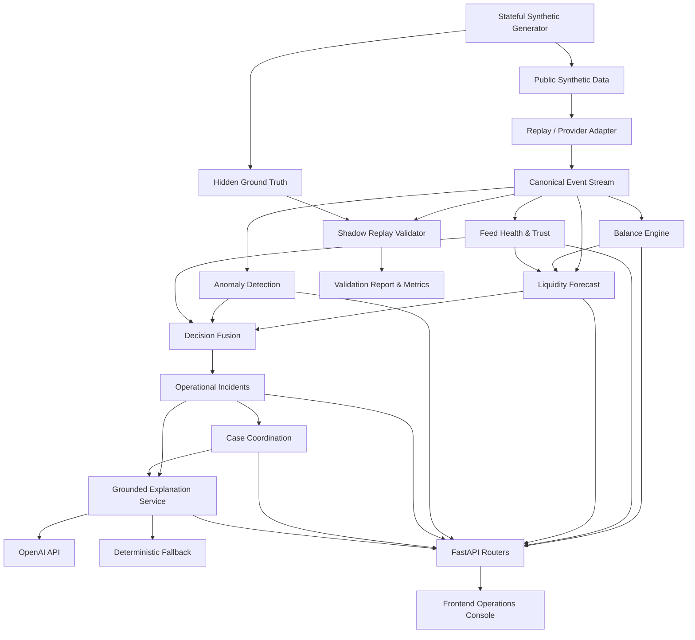
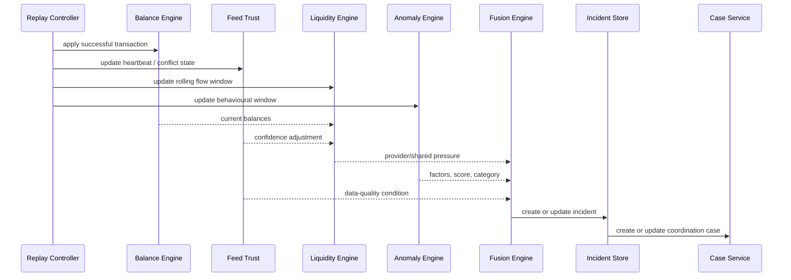
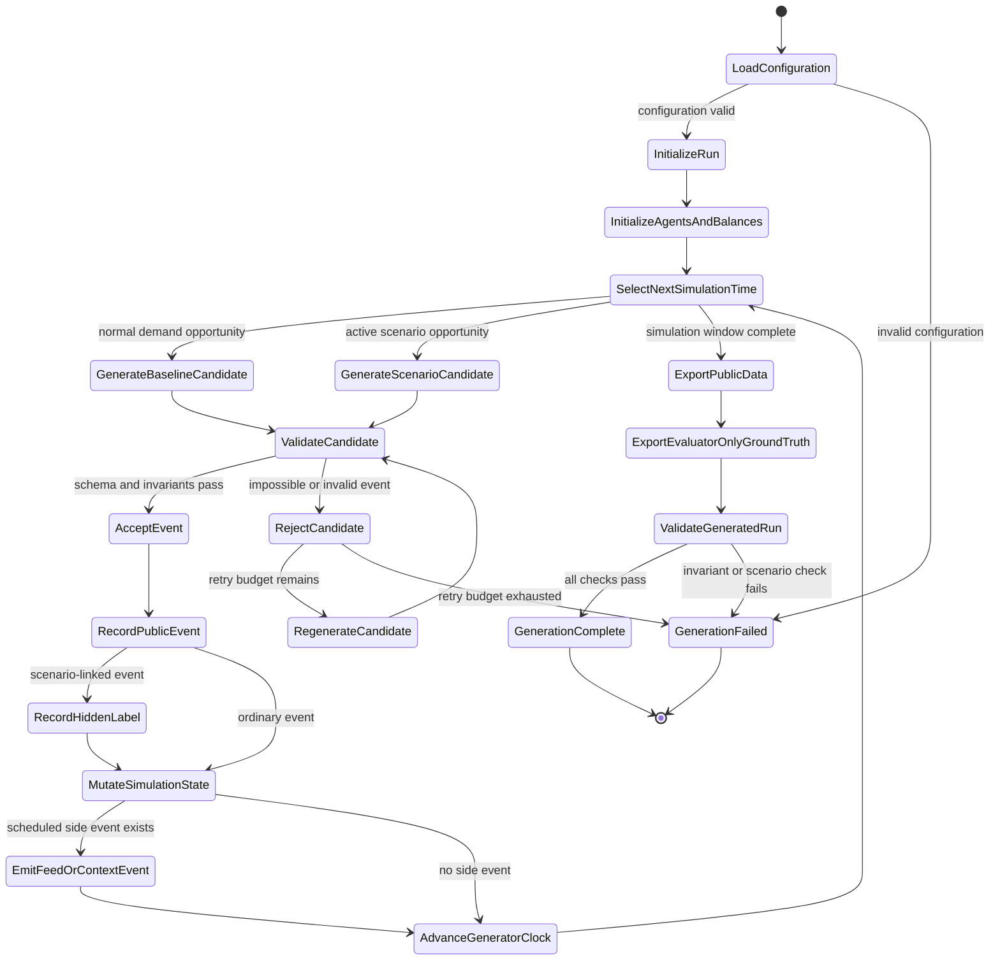
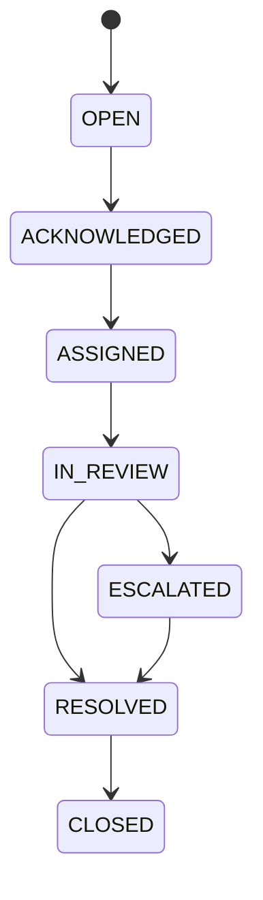

# Super Agent Liquidity & Risk Intelligence Platform — Backend

A provider-aware, explainable, and human-centered decision-support backend for multi-provider mobile financial service agents.

This prototype helps an agent operation understand four questions in one connected workflow:

1. **What is the current shared-cash and provider-specific e-money position?**
2. **Which resource may face pressure next, and approximately when?**
3. **Is the activity a normal demand spike, a data-quality problem, or a pattern requiring review?**
4. **Who should receive, own, acknowledge, escalate, and resolve the case?**

The platform is deliberately **advisory only**. It does not move money, merge provider wallets, block accounts, freeze funds, or make a final fraud determination.

---

## Table of contents

- [Why this project exists](#why-this-project-exists)
- [The problem in one relatable story](#the-problem-in-one-relatable-story)
- [What the platform does](#what-the-platform-does)
- [What the platform intentionally does not do](#what-the-platform-intentionally-does-not-do)
- [Architecture at a glance](#architecture-at-a-glance)
- [End-to-end event flow](#end-to-end-event-flow)
- [Key architectural decisions](#key-architectural-decisions)
- [Core domain model](#core-domain-model)
- [Simulation and hidden ground truth](#simulation-and-hidden-ground-truth)
- [Data generation state machine](#data-generation-state-machine)
- [Liquidity, anomaly, data trust, and fusion](#liquidity-anomaly-data-trust-and-fusion)
- [Incidents, cases, and auditability](#incidents-cases-and-auditability)
- [Grounded multilingual AI explanations](#grounded-multilingual-ai-explanations)
- [Provider boundaries and role awareness](#provider-boundaries-and-role-awareness)
- [API overview](#api-overview)
- [Repository structure](#repository-structure)
- [Quick start](#quick-start)
- [Configuration](#configuration)
- [Generating the synthetic dataset](#generating-the-synthetic-dataset)
- [Running the replay](#running-the-replay)
- [Testing every layer](#testing-every-layer)
- [Validation evidence](#validation-evidence)
- [Demo walkthrough](#demo-walkthrough)
- [Responsible design](#responsible-design)
- [Known prototype boundaries and production evolution](#known-prototype-boundaries-and-production-evolution)
- [How this repository maps to the hackathon requirements](#how-this-repository-maps-to-the-hackathon-requirements)
- [Troubleshooting](#troubleshooting)
- [License and team](#license-and-team)

---

## Why this project exists

Many mobile financial service agents serve customers through several providers such as bKash, Nagad, and Rocket. Operationally, they share one pool of physical cash, but each provider maintains a separate electronic balance.

That creates a non-obvious problem:

> An outlet may look healthy when all value is viewed together, while one provider-specific balance or the shared cash reserve is close to becoming unusable.

The operational difficulty becomes greater when unusual transaction behaviour and poor data quality appear at the same time. A rapid cash-out surge may be:

- normal pre-Eid demand,
- an agent-specific liquidity problem,
- repeated or concentrated activity requiring review,
- a delayed provider feed,
- a conflicting balance checkpoint,
- or several of these conditions together.

The platform was designed to connect these concerns rather than display them as unrelated charts.

---

## The problem in one relatable story

Imagine a busy market outlet on the afternoon before Eid.

The outlet serves customers from three providers:

```text
Shared physical cash:  ৳300,000
bKash e-money:          ৳18,000
Nagad e-money:         ৳145,000
Rocket e-money:        ৳112,000
```

A simple total may suggest that the outlet is healthy. In reality, bKash service is close to disruption.

At the same time:

- several recent requests have nearly identical amounts,
- a small group of synthetic accounts generates most of the requests,
- one provider feed is becoming stale,
- the field officer has not yet acknowledged the case,
- and no single person is visibly responsible for the next step.

This backend turns that situation into a traceable operational flow:

```text
provider-separated events
        ↓
shared cash + provider-specific balances
        ↓
liquidity pressure and approximate timing
        ↓
unusual-activity evidence and uncertainty
        ↓
data-trust adjustment
        ↓
operational incident
        ↓
receiver, owner, escalation, and resolution
        ↓
grounded stakeholder-specific explanation
```

---

## What the platform does

### Unified but not merged liquidity visibility

The system displays and analyses:

- one shared physical-cash position per agent,
- one separate e-money position per agent and provider,
- provider-level liquidity pressure,
- shared-cash pressure,
- aggregate operational readiness without implying balance interchangeability.

### Forward-looking liquidity insight

The system estimates:

- current liquidity condition,
- recent net depletion rate,
- approximate time to a configured safety threshold,
- approximate time to depletion where meaningful,
- confidence based on data availability and consistency.

### Explainable unusual-activity detection

The system can surface evidence such as:

- elevated transaction velocity,
- near-identical amounts,
- concentration among a small set of synthetic accounts,
- abnormal failure behaviour,
- cross-provider linked activity using simulated identifiers.

The output uses careful language such as **unusual activity** or **requires review**. It does not declare fraud.

### Data-quality awareness

The backend treats data trust as a first-class analytical input. It can represent:

- healthy feeds,
- stale feeds,
- missing feeds,
- recovered feeds,
- conflicting reported and calculated balances.

Low-quality input lowers confidence and can disable strong recommendations.

### Human coordination

Important incidents become cases that can be:

- routed,
- acknowledged,
- assigned,
- reviewed,
- annotated,
- escalated,
- resolved,
- closed,
- audited.

### Grounded multilingual explanation

Structured incident and case facts can be rendered in:

- English,
- Bangla,
- Banglish.

The AI explanation layer cannot change balances, scores, priorities, evidence, case ownership, or workflow status.

### Reproducible simulation and measurable evaluation

The same deterministic event stream supports both:

- a time-compressed live replay for the frontend,
- an offline shadow evaluator for precision, recall, false-positive, reliability, coverage, and latency measurements.

---

## What the platform intentionally does not do

The following boundaries are design decisions, not missing product ambition:

| Action | Performed? | Reason |
|---|---:|---|
| Merge provider balances | No | Provider balances are logically and operationally separate |
| Convert one provider balance into another | No | No interoperability or settlement is implied |
| Transfer or refill liquidity automatically | No | Financial action requires authorized provider processes |
| Block or freeze an account | No | The system is advisory and human-reviewed |
| Declare fraud | No | An anomaly is evidence for review, not proof |
| Access production provider APIs | No | The prototype uses synthetic provider-like feeds |
| Use real customer identities | No | Synthetic identifiers preserve privacy |
| Collect PINs, OTPs, passwords, or private keys | No | Sensitive credentials are unnecessary and prohibited |
| Claim regulatory or production approval | No | The prototype demonstrates engineering and analytical concepts only |

---

## Architecture at a glance

The backend is a **modular monolith**: one deployable FastAPI application with strongly separated domain modules.



The architecture deliberately places deterministic analytics before language generation:

```text
facts and calculations first
        ↓
incident and case state second
        ↓
AI wording last
```

This makes the AI useful without making the safety-critical workflow dependent on a probabilistic model.

---

## End-to-end event flow

For each replayed event:



A transaction, feed event, or context event is processed through the same core pipeline used by the validator. The live demo and the measured evaluation therefore describe the same system.

---

# Key architectural decisions

This section records the major design decisions, why they relate to the challenge, and the trade-offs accepted for a prototype.

## 1. Modular monolith instead of microservices

### Decision

All core modules run inside one FastAPI process while maintaining clear package and service boundaries.

### Why this fits the problem

The challenge values end-to-end completeness, integration quality, reliability, and demonstrable engineering depth. A modular monolith lets the team spend effort on:

- correct provider-aware balances,
- forecasting,
- anomaly evidence,
- coordination,
- validation,
- safe explanations,

rather than internal service networking and deployment orchestration.

### What it solves

- simple local setup,
- fast in-process communication,
- easier deterministic replay,
- easier end-to-end tests,
- fewer demo-time failure points.

### Trade-off

Modules cannot be scaled independently and in-memory state is process-local.

### Production evolution

The domain boundaries are already separated enough that ingestion, analytics, cases, and explanations could later become independent services if scale requires it.

---

## 2. Canonical event model behind provider adapters

### Decision

Provider-like input is transformed into canonical transaction, feed-health, balance-checkpoint, and context events before entering the core engines.

### Why this fits the problem

The platform must represent multiple logically separate providers without pretending that real technical integration already exists.

### What it solves

- the balance and analytical engines do not contain provider-specific parsing logic,
- replay data and future live adapters can share the same downstream contract,
- provider separation is preserved at the data boundary,
- changes to one adapter do not require rewriting the core engines.

### Trade-off

A canonical schema can omit provider-specific details if it is designed too narrowly.

### Production evolution

Versioned provider adapters and event schemas can preserve provider-specific extensions while maintaining a stable analytical contract.

---

## 3. Deterministic, seeded synthetic simulation

### Decision

Synthetic data is generated from a fixed seed and validated configuration.

### Why this fits the problem

The challenge explicitly requires simulated, mock, anonymized, or safe public data and asks teams to document assumptions and limitations.

### What it solves

- the same configuration produces the same dataset,
- the demo is repeatable,
- tests are stable,
- metrics can be reproduced,
- debugging does not depend on a changing random stream.

### Trade-off

A deterministic synthetic day cannot represent all real-world behaviour.

### Production evolution

The simulator remains valuable even after real integrations exist because it can support regression, chaos, failure, and scenario testing without exposing customer data.

---

## 4. Hidden ground truth separated from public events

### Decision

Scenario labels and expected conditions are written to an evaluator-only directory. They are not included in public transaction data and are not available to the balance, forecast, anomaly, fusion, or case engines.

### Why this fits the problem

Metrics are meaningful only when the detector cannot read the answer.

### What it solves

- prevents scenario-label leakage,
- enables honest precision and recall,
- proves that detection emerges from transaction, timing, account, balance, and feed behaviour,
- separates demonstration data from evaluation truth.

### Trade-off

The labels are still synthetic and reflect designed scenarios rather than expert-reviewed production cases.

### Production evolution

A future evaluation pipeline would use anonymized, reviewed labels, temporal holdout periods, calibration, and drift monitoring.

---

## 5. Stateful ledger rather than precomputed balance lookup

### Decision

Current balances are derived from opening balances and replayed transaction effects.

### Why this fits the problem

The product must show live operational pressure, not read a final balance from a prepared table.

### What it solves

- continuous state changes,
- correct cash/e-money direction,
- replayable balance history,
- financial invariant checks,
- meaningful forecast inputs.

### Trade-off

The prototype ledger models operational liquidity, not full financial accounting, settlement, fees, reconciliation, or reversal chains.

### Production evolution

Use durable event storage, idempotency keys, transactional persistence, versioned events, and formal reconciliation processes.

---

## 6. `Decimal` for financial values

### Decision

Money is represented with `Decimal`, not binary floating-point values.

### Why this fits the problem

Balances and transaction effects must remain exact and reproducible.

### What it solves

- avoids floating-point drift,
- keeps financial invariants stable,
- produces deterministic arithmetic,
- prevents subtle comparison failures.

### Trade-off

`Decimal` is slower than `float`, but the demonstrated data volume is far below the level where this becomes material.

---

## 7. Timezone-aware timestamps

### Decision

Events use timezone-aware timestamps and are replayed chronologically.

### Why this fits the problem

Shortage timing, rolling windows, feed age, acknowledgement time, and escalation history are all time-sensitive.

### What it solves

- deterministic ordering,
- correct window calculations,
- reliable detection delay measurements,
- consistent audit timelines.

### Trade-off

The prototype primarily targets one simulation timezone; multi-region production deployment would require stricter timezone and clock-skew handling.

---

## 8. Enums for closed domain states

### Decision

Stable domain values are represented by enums, for example:

- provider IDs,
- transaction types,
- transaction status,
- feed-health status,
- liquidity status,
- anomaly category,
- incident type,
- incident priority,
- case status,
- routing role,
- explanation language and audience.

### Why this fits the problem

The system contains many safety-relevant states. Free-form strings would make typos and invalid transitions easier.

### What it solves

- consistent API values,
- Pydantic validation,
- safer branching,
- clearer OpenAPI documentation,
- explicit business vocabulary,
- easier frontend integration.

### Trade-off

Adding a new provider or state requires a code and contract change.

### Production evolution

Stable workflow states should remain versioned contracts. Highly dynamic reference data, such as provider registration metadata, can move to database-backed configuration.

---

## 9. Pydantic models at system boundaries

### Decision

Pydantic validates configuration, events, API requests, API responses, incidents, cases, and explanation structures.

### Why this fits the problem

Missing, late, conflicting, or malformed provider data must not silently become a confident result.

### What it solves

- rejects invalid enum values,
- parses datetimes and decimals consistently,
- documents API contracts,
- validates cross-field constraints,
- prevents malformed data from entering analytical engines.

### Trade-off

Runtime validation adds overhead and does not replace business-rule validation.

### Production evolution

Boundary validation remains, while high-throughput internal paths may use optimized typed events after successful ingestion validation.

---

## 10. Simulation/replay adapter instead of wall-clock execution

### Decision

The generated business day is replayed through a controllable simulated clock.

### Why this fits the problem

A live demo must show a complete operational story in minutes rather than wait through a full real-world day.

### What it solves

- resettable demo,
- time-compressed progression,
- deterministic state reproduction,
- shared engine for UI and validation,
- no dependency on production feeds.

### Trade-off

Replay does not reproduce all timing and concurrency behaviour of a distributed provider environment.

### Production evolution

Replace the replay adapter with authorized provider-specific ingestion adapters while keeping the downstream event contract unchanged.

---

## 11. One continuous engine; scenarios are tests, not code paths

### Decision

The liquidity and anomaly engines process all events continuously. They do not branch on hidden scenario IDs.

### Why this fits the problem

The platform should behave like an operational system, not a scripted slideshow.

### What it solves

- one general pipeline across normal and abnormal behaviour,
- scenario independence,
- honest evaluation,
- less brittle code,
- a convincing live demonstration.

### Trade-off

General thresholds may need careful tuning to detect rare patterns without creating excessive alerts.

### Production evolution

Thresholds can be calibrated per agent/provider and later complemented by trained models while preserving explainable evidence and human review.

---

## 12. Feed health and data trust as a first-class engine

### Decision

Feed freshness, missing heartbeats, recovery, and balance conflicts are modelled separately from transaction behaviour.

### Why this fits the problem

A safe system must not treat missing or conflicting data as normal activity.

### What it solves

- explicit `HEALTHY`, `STALE`, `MISSING`, and `CONFLICTING` states,
- lower forecast confidence when data quality degrades,
- safe fallback recommendations,
- dedicated data-quality incidents,
- traceable recovery behaviour.

### Trade-off

Current confidence adjustments are heuristic rather than statistically calibrated against real provider outages.

### Production evolution

Calibrate confidence using historical feed reliability, schema errors, lag distributions, reconciliation outcomes, and provider-specific service-level objectives.

---

## 13. Separate shared-cash and provider-specific forecasting

### Decision

Liquidity is forecast for both:

- the agent's shared physical cash,
- each provider-specific e-money balance.

### Why this fits the problem

The central business insight is that an aggregate view may look healthy while one provider is near disruption.

### What it solves

- hidden provider shortage detection,
- provider-aware prioritization,
- shared-cash exposure detection,
- visible disagreement between aggregate and provider-level conditions.

### Trade-off

The current forecast primarily extrapolates recent net flow and uses heuristic thresholds. It is not a statistically calibrated long-horizon model.

### Production evolution

Introduce seasonal baselines, quantile forecasts, agent/provider-specific calibration, confidence intervals, local-event context, and backtesting.

---

## 14. Weighted explainable anomaly scoring

### Decision

The anomaly engine produces a score, band, category, contributing factors, evidence, and alternative explanations instead of a single boolean flag.

### Why this fits the problem

Every high-impact alert must expose why it was raised and acknowledge uncertainty.

### What it solves

- visible factor contributions,
- distinction between legitimate demand and concentrated activity,
- transparent review threshold,
- easier audit and explanation,
- safer human decisions.

### Trade-off

Rules and thresholds are manually designed for the synthetic environment.

### Production evolution

Combine calibrated rules with monitored statistical or machine-learning signals, preserving factor-level evidence and human-review boundaries.

---

## 15. Decision fusion before alert creation

### Decision

Liquidity, anomaly, and data-quality outputs are combined into an operational interpretation before incidents are created.

### Why this fits the problem

The challenge asks for three connected problems, not three isolated dashboards.

### What it solves

- combined-priority incidents,
- lower alert duplication,
- clearer operational meaning,
- one evidence package for the reviewer,
- direct transition from analytics to coordination.

### Trade-off

Manually encoded fusion rules may merge signals too aggressively or too conservatively.

### Production evolution

Tune deduplication windows, preserve signal lineage, and evaluate fusion policies with operator feedback.

---

## 16. Incident deduplication by operational key

### Decision

Repeated observations update an existing incident when they represent the same ongoing problem.

### Why this fits the problem

Operators need a manageable queue, not a new alert for every transaction.

### What it solves

- reduces alert fatigue,
- preserves occurrence count,
- updates evidence and priority over time,
- supports one traceable case per operational issue.

### Trade-off

An overly broad incident key may combine two genuinely separate events.

### Production evolution

Use configurable correlation windows, signal lineage, split/merge controls, and operator-assisted incident grouping.

---

## 17. Receiver, responsible stakeholder, and case owner are separate

### Decision

The case model separates:

- who receives the alert,
- which function is responsible,
- which specific human owns the case,
- where escalation should go.

### Why this fits the problem

These concepts are explicitly different in real operations and in the challenge requirements.

### What it solves

- avoids an ambiguous `assigned_to` field,
- supports acknowledgement before ownership,
- makes accountability visible,
- represents organizational and individual responsibility separately.

### Trade-off

The prototype uses simulated actors and does not integrate with a real identity directory.

### Production evolution

Connect to authenticated organizational identity, territory mapping, provider tenancy, and escalation schedules.

---

## 18. Case workflow implemented as a state machine

### Decision

Cases move through controlled states such as open, acknowledged, assigned, in review, escalated, resolved, and closed.

### Why this fits the problem

The challenge expects acknowledgement, ownership, escalation, final status, and traceability.

### What it solves

- prevents impossible transitions,
- makes workflow behaviour testable,
- supports role-aware actions,
- creates a complete audit history.

### Trade-off

The state machine represents the challenge workflow rather than every provider's real internal process.

### Production evolution

Make workflow definitions provider-configurable while preserving audited transition rules.

---

## 19. AI is an explanation layer, not a decision engine

### Decision

OpenAI receives a minimized structured grounding payload after deterministic analytics have produced the incident and case.

### Why this fits the problem

The challenge asks for meaningful use of AI, APIs, analytics, or data processing, while also requiring safety, explainability, and human review.

### What it solves

- multilingual stakeholder communication,
- consistent structure for situation, evidence, uncertainty, and next step,
- no AI-generated balances or scores,
- graceful fallback when the API is unavailable,
- reduced hallucination risk.

### Trade-off

AI wording can vary and depends on external availability, latency, and quota.

### Production evolution

Add prompt/model versioning, caching, evaluation datasets, output monitoring, and a provider-approved deployment policy.

---

## 20. Structured AI output with deterministic fallback

### Decision

The explanation service expects structured fields and validates grounding and safety. Invalid, unavailable, or unsafe output falls back to deterministic templates.

### Why this fits the problem

Missing AI service must not disable the operational platform.

### What it solves

- predictable frontend rendering,
- required uncertainty section,
- safe operation without an API key,
- explicit explanation source,
- lower demo risk.

### Trade-off

Template output is less natural and language validation is heuristic.

### Production evolution

Expand reviewed templates, language-specific validation, model evaluation, and human-approved phrasing libraries.

---

## 21. Provider-aware redaction

### Decision

A provider-scoped viewer may receive its own raw context and a redacted indication that related activity exists elsewhere, without receiving another provider's confidential details.

### Why this fits the problem

The platform must preserve provider separation even while offering cross-provider operational insight.

### What it solves

- supports cross-provider patterns without raw data leakage,
- keeps provider scope visible,
- prevents one provider from appearing to control another provider's data or decisions.

### Trade-off

The current prototype enforces provider-aware redaction most strongly in explanations and case actions; full production-grade read-side authorization requires authenticated identity and data-layer enforcement.

### Production evolution

Add OIDC/JWT authentication, provider and territory claims, row-level security, tenant-scoped storage, access logs, and policy tests.

---

## 22. Offline validator uses the same core engines as the live demo

### Decision

The shadow evaluator replays the same public event stream through the same balance, trust, liquidity, anomaly, fusion, and case engines used by the API.

### Why this fits the problem

Validation evidence should describe the actual demonstrated system.

### What it solves

- prevents a separate “metrics-only” implementation,
- makes performance results reproducible,
- links scenario checks to real incident behaviour,
- provides engineering evidence end to end.

### Trade-off

The scenario set is finite and synthetic, so high metrics must not be presented as production accuracy.

### Production evolution

Use larger temporal holdouts, real anonymized backtests, calibration, stress tests, and continuous monitoring.

---

## 23. FastAPI routers and dependency injection

### Decision

API routes are separated by domain and receive shared services through FastAPI dependencies and application lifespan state.

### Why this fits the problem

The platform exposes several connected but distinct capabilities and needs clear contracts for frontend integration and testing.

### What it solves

- smaller routers,
- generated OpenAPI documentation,
- shared engine state,
- dependency replacement in tests,
- clean service/API separation.

### Trade-off

`app.state` is simpler than a full dependency-injection container and is process-local.

### Production evolution

Introduce a stronger composition root, persistent repositories, background workers, and process-safe state management where needed.

---

## 24. Domain exceptions separated from HTTP errors

### Decision

Services raise domain-specific errors; routers translate them into HTTP status codes.

### Why this fits the problem

Core logic should remain usable from tests, scripts, background jobs, or other transports.

### What it solves

- transport-independent services,
- clearer error semantics,
- easier unit tests,
- consistent API responses.

### Trade-off

Broad exception handling can hide programming errors if used carelessly.

### Production evolution

Use narrow exception mapping, structured error codes, trace IDs, and centralized observability.

---

# Core domain model

## Agent and provider resources

```text
Agent
├── shared physical cash
├── bKash e-money
├── Nagad e-money
└── Rocket e-money
```

Shared cash belongs to the agent. Provider e-money belongs to the `agent × provider` position.

## Transaction types

The exact ledger direction is defined in the balance engine. Conceptually:

### Cash-out

- customer receives physical cash,
- shared cash decreases,
- provider e-money increases.

### Cash-in

- customer gives physical cash,
- shared cash increases,
- provider e-money decreases.

Failed transactions do not change financial state.

## Data-trust states

```text
HEALTHY
STALE
MISSING
CONFLICTING
```

## Liquidity states

```text
SAFE
WATCH
CRITICAL
DEPLETED
INSUFFICIENT_DATA
```

`INSUFFICIENT_DATA` is important: sometimes the correct answer is not a weak forecast, but an explicit statement that the system cannot support a reliable conclusion.

## Anomaly categories

Typical categories include:

```text
NORMAL_ACTIVITY
LEGITIMATE_DEMAND_SPIKE
DATA_QUALITY_ISSUE
REQUIRES_REVIEW
```

## Incident types

Typical fused incident types include:

```text
LIQUIDITY_PRESSURE
UNUSUAL_ACTIVITY
COMBINED_PRIORITY
DATA_QUALITY
```

## Coordination concepts

```text
receiver role
responsible stakeholder
case owner
escalation target
resolution status
```

These are intentionally separate fields.

---

# Simulation and hidden ground truth

The simulator creates a realistic but safe provider ecosystem using only synthetic identifiers.

## Public operational data

Typical files:

```text
data/synthetic_v2/
├── agents.csv
├── opening_balances.csv
├── transactions.csv
├── feed_events.csv
└── context_events.csv
```

Public data may contain:

- agent ID,
- provider ID,
- synthetic account ID,
- timestamp,
- transaction type,
- amount,
- status,
- area,
- opening balance,
- feed heartbeat or conflict event,
- local context flag.

## Evaluator-only data

```text
data/ground_truth_v2/
├── scenario_labels.csv
├── transaction_failures.csv
└── scenario_manifest.json
```

The analytical engines never receive `scenario_id`.

## Scenario examples

| Scenario | Purpose |
|---|---|
| Hidden provider shortage | Prove that provider-level risk can be hidden by a healthy aggregate view |
| Repeated cash-out cluster | Test near-identical amount and account-concentration evidence |
| Legitimate Eid demand | Measure hard-negative false-positive behaviour |
| Feed delay and recovery | Test stale/missing confidence reduction and recovery |
| Balance conflict | Test reported-versus-calculated inconsistency handling |
| Cross-provider linked activity | Test redacted cross-provider context using simulated identifiers |

## Reproducibility

The current baseline validation run uses:

```text
run_id: DEMO-DAY-V2
seed:   20260711
```

Given the same generator code, configuration, and seed, the dataset is reproducible.

---

# Data generation state machine

The synthetic dataset is not produced by independently writing random CSV rows. The generator maintains a valid operational state while time advances, creates candidate events, checks those candidates against financial and scenario constraints, and mutates balances only after an event is accepted.



## What each state means

| State | Responsibility | Why it exists |
|---|---|---|
| `LoadConfiguration` | Parse seed, agents, providers, time window, balances, and scenario parameters | Invalid or incomplete configuration should fail before any files are written |
| `InitializeRun` | Create run metadata and seeded random sources | Keeps every stochastic decision reproducible |
| `InitializeAgentsAndBalances` | Establish opening shared cash and separate provider e-money | Gives every later transaction a financially meaningful starting state |
| `SelectNextSimulationTime` | Move through the synthetic operating day in chronological order | Prevents timestamps from being generated as unrelated random values |
| `GenerateBaselineCandidate` | Propose normal demand based on agent and time-of-day behaviour | Creates the background activity needed to make scenarios realistic |
| `GenerateScenarioCandidate` | Let an active scenario influence a candidate event | Injects pressure or unusual behaviour without exposing hidden scenario labels to analytics |
| `ValidateCandidate` | Check schema, provider scope, transaction feasibility, identifiers, and balance effects | Stops impossible transactions and corrupted events from entering the dataset |
| `RejectCandidate` / `RegenerateCandidate` | Discard invalid candidates and retry within a bounded budget | Preserves realism without allowing an infinite generation loop |
| `RecordPublicEvent` | Write the provider-like event visible to replay and analytics | Ensures the live system sees only operational evidence |
| `RecordHiddenLabel` | Store evaluator-only scenario linkage separately | Enables honest validation without leaking the answer |
| `MutateSimulationState` | Apply an accepted event to shared cash, provider balance, counters, and scenario state | Makes future events depend on what has already happened |
| `EmitFeedOrContextEvent` | Produce heartbeat, recovery, conflict, or local-context events when scheduled | Allows data trust and legitimate-demand context to be tested alongside transactions |
| `ExportPublicData` | Finalize public CSV files in stable chronological order | Produces the dataset consumed by the replay adapter |
| `ExportEvaluatorOnlyGroundTruth` | Finalize hidden labels and expected scenario windows | Keeps operational and evaluation data physically separate |
| `ValidateGeneratedRun` | Check invariants, leakage, references, scenario evidence, and expected outcomes | Prevents a visually interesting but analytically invalid dataset from becoming the demo dataset |

## Why generation is stateful

A row-by-row random generator could create more data with less code, but it would not reliably preserve the operating model. The state machine ensures that:

- a successful transaction changes the next available balance,
- shared cash and provider e-money remain separate,
- failed transactions do not mutate balances,
- scenario events coexist with ordinary demand,
- feed and context events occur at meaningful times,
- hidden labels cannot appear in public files,
- invalid candidates are rejected before state is changed,
- the same seed and configuration reproduce the same accepted event sequence.

## Accepted limitation

The state machine models a controlled prototype environment rather than every production provider behaviour. It intentionally simplifies settlement, fees, reversals, concurrency, network reordering, and provider-specific reconciliation. This keeps the simulation inspectable and reproducible while preserving the liquidity, data-quality, anomaly, and coordination behaviours required for the prototype. Those omitted behaviours are extension points for future provider adapters and a durable event-driven implementation, not weaknesses in the demonstrated decision-support flow.

---

# Liquidity, anomaly, data trust, and fusion

## Liquidity forecasting

The engine uses recent transaction flow to estimate net depletion.

Conceptually:

```text
net depletion rate = recent outflow per minute - recent inflow per minute
```

Where depletion is positive:

```text
minutes to threshold = (current balance - safety threshold) / depletion rate
minutes to depletion = current balance / depletion rate
```

The engine also requires sufficient recent evidence and applies data-trust adjustments.

## Anomaly scoring

The anomaly engine records weighted factors rather than a black-box conclusion.

Example:

| Factor | Example meaning |
|---|---|
| Transaction velocity | Recent activity materially exceeds baseline |
| Near-identical amounts | Many recent amounts fall within a narrow tolerance |
| Account concentration | A small synthetic account group dominates activity |
| Cross-provider link | Related synthetic behaviour appears across providers |
| Failure burst | Failure behaviour rises beyond expected baseline |

The result includes:

- score,
- band,
- category,
- factor codes,
- factor contributions,
- evidence,
- uncertainty,
- alternative explanations,
- whether human review is required.

## Fusion

Fusion combines the analytical outputs into one operational decision object.

Examples:

```text
liquidity pressure only
→ liquidity incident

unusual behaviour only
→ review incident

liquidity pressure + unusual behaviour
→ combined-priority incident

stale/missing/conflicting data
→ data-quality incident or confidence reduction
```

This prevents the frontend from making users mentally connect unrelated alerts.

---

# Incidents, cases, and auditability

An incident is a structured operational object, not only a message.

Typical fields include:

```text
incident_id
incident_key
agent_id
provider_scope
incident_type
priority
status
confidence
receiver_role
responsible_stakeholder
recommended_next_step
human_review_required
evidence
uncertainty
alternative_explanations
created_at
updated_at
occurrence_count
```

## Case lifecycle



The service validates legal transitions.

## Audit history

Every important action records:

- actor,
- action,
- previous state,
- new state,
- timestamp,
- note or reason,
- provider scope where relevant.

The workflow intentionally stops before any final fraud determination or financial action.

---

# Grounded multilingual AI explanations

The explanation service receives an already-created incident and optional case.

It may generate structured output such as:

```text
headline
situation
evidence
uncertainty
safe next step
provider-boundary notice
```

## AI cannot change

- balances,
- forecast values,
- anomaly score,
- evidence,
- confidence,
- provider scope,
- receiver role,
- case owner,
- status,
- resolution.

## Safety and grounding checks

Generated text is rejected or replaced when it:

- claims confirmed fraud,
- recommends blocking or freezing,
- recommends automatic transfer or refill,
- invents unsupported numbers,
- exposes another provider's hidden details,
- omits required uncertainty or safe-next-step structure.

## Fallback

When AI is disabled, unavailable, timed out, quota-limited, or unsafe, the backend returns a deterministic template explanation.

The operational platform therefore remains usable without an AI key.

---

# Provider boundaries and role awareness

The domain model represents:

- agents,
- field officers,
- provider operations,
- risk reviewers,
- management.

Current role-aware behaviour includes:

- receiver and responsible-stakeholder routing,
- provider-aware case actors,
- provider-scoped notes and actions,
- audience-specific explanations,
- provider-aware explanation redaction.

The canonical analytical endpoints are also useful for testing and internal validation. A production deployment would additionally enforce authenticated role/provider/territory projections for every read endpoint.

This is an intentional distinction between:

```text
prototype domain enforcement
and
production identity/security infrastructure
```

The architecture is ready for stronger enforcement through a centralized access policy, verified identity claims, and data-layer row security.

---

# API overview

FastAPI exposes interactive documentation at:

```text
http://127.0.0.1:8000/docs
```

The generated OpenAPI document is available at:

```text
http://127.0.0.1:8000/openapi.json
```

Typical API groups include:

| Group | Purpose |
|---|---|
| `/api/v1/health` | Application readiness and health |
| `/api/v1/replay` | Reset, inspect, and advance the simulated clock |
| `/api/v1/balances` | Shared cash and provider-specific balances |
| `/api/v1/data-quality` | Feed health, age, conflict, and confidence |
| `/api/v1/liquidity` | Shared and provider-level forecasts |
| `/api/v1/anomalies` | Explainable unusual-activity assessments |
| `/api/v1/incidents` | Operational incident lists and details |
| `/api/v1/cases` | Coordination queue, actions, notes, history, resolution |
| `/api/v1/explanations` | AI/template explanations and service health |

The OpenAPI schema is the authoritative source when local route names differ from this overview.

---

# Repository structure

A typical repository layout is:

```text
super-agent-backend/
├── app/
│   ├── api/
│   │   ├── dependencies.py
│   │   └── v1/
│   ├── cases/
│   ├── core/
│   ├── data_quality/
│   ├── explanations/
│   ├── ingestion/
│   ├── intelligence/
│   ├── ledger/
│   ├── replay/
│   ├── schemas/
│   ├── simulation/
│   └── main.py
├── configs/
│   └── simulations/
├── data/
│   ├── synthetic_v2/
│   └── ground_truth_v2/
├── scripts/
│   ├── generate_simulation_v2.py
│   └── validate_simulation_v2.py
├── tests/
│   ├── unit/
│   └── integration/
├── artifacts/
│   └── validation/
├── .env.example
├── pyproject.toml
└── README.md
```

The exact structure may differ slightly; use the repository's current package names as the source of truth.

---

# Quick start

## Prerequisites

- the Python version declared in `pyproject.toml`,
- `pip` or the dependency manager used by the repository,
- Git,
- optional OpenAI API key for AI-generated wording.

## 1. Clone and enter the backend

```bash
git clone <repository-url>
cd super-agent-backend
```

## 2. Create a virtual environment

```bash
python -m venv venv
source venv/bin/activate
```

Windows PowerShell:

```powershell
python -m venv venv
venv\Scripts\Activate.ps1
```

## 3. Install dependencies

When the project uses `pyproject.toml`:

```bash
pip install -e .
```

For development/test extras, use the extras declared by the project, for example:

```bash
pip install -e ".[dev]"
```

## 4. Configure the environment

```bash
cp .env.example .env
```

Keep the OpenAI key empty when testing deterministic fallback only.

## 5. Generate synthetic data

```bash
python scripts/generate_simulation_v2.py
```

## 6. Validate the generated run

```bash
python scripts/validate_simulation_v2.py
```

## 7. Start the API

```bash
uvicorn app.main:app --reload
```

## 8. Open API documentation

```text
http://127.0.0.1:8000/docs
```

---

# Configuration

A typical `.env` includes values similar to:

```env
APP_ENV=development
LOG_LEVEL=INFO

SYNTHETIC_DATA_DIR=data/synthetic_v2
GROUND_TRUTH_DIR=data/ground_truth_v2

OPENAI_API_KEY=
OPENAI_EXPLANATIONS_ENABLED=false
OPENAI_EXPLANATION_MODEL=
OPENAI_EXPLANATION_TIMEOUT_SECONDS=20
OPENAI_EXPLANATION_MAX_OUTPUT_TOKENS=900
```

Important rules:

- never commit the real `.env`,
- never expose the API key to the frontend,
- keep AI optional,
- use `.env.example` with non-secret placeholders,
- use the actual field names defined in `app/core/config.py`.

---

# Generating the synthetic dataset

Generate the current configured simulation:

```bash
python scripts/generate_simulation_v2.py
```

Inspect the output volume:

```bash
wc -l data/synthetic_v2/*.csv
```

Inspect transaction distribution:

```bash
python - <<'PY'
import pandas as pd

path = "data/synthetic_v2/transactions.csv"
df = pd.read_csv(path)

print("Transactions:", len(df))
print("\nBy agent:")
print(df.groupby("agent_id").size().sort_values(ascending=False))
print("\nBy provider:")
print(df.groupby("provider_id").size())
print("\nBy transaction type:")
print(df.groupby("transaction_type").size())
print("\nBy status:")
print(df.groupby("status").size())
PY
```

Before accepting a generated dataset, confirm:

- unique transaction IDs,
- chronological ordering,
- valid ground-truth references,
- no public scenario-label leakage,
- no unexplained negative balances,
- expected scenario patterns exist,
- hard-negative scenarios remain non-review outcomes where intended.

---

# Running the replay

Set a base URL:

```bash
export API="http://127.0.0.1:8000/api/v1"
```

Reset:

```bash
curl -sS -X POST "$API/replay/reset" | jq
```

Advance 15 simulated minutes:

```bash
curl -sS -X POST \
  "$API/replay/advance" \
  -H "Content-Type: application/json" \
  -d '{"minutes":15}' | jq
```

Inspect current state:

```bash
curl -sS "$API/balances" | jq
curl -sS "$API/data-quality" | jq
curl -sS "$API/liquidity" | jq
curl -sS "$API/anomalies" | jq
curl -sS "$API/incidents" | jq
curl -sS "$API/cases/queue" | jq
```

Resetting does not regenerate the dataset. It restores the replay and engines to the opening state and processes the same fixed event stream again.

---

# Testing every layer

## Full test suite

```bash
pytest -v
```

## Unit tests

Unit tests should cover:

- canonical schema validation,
- money arithmetic,
- balance effects,
- feed-health transitions,
- forecast bands,
- anomaly factors,
- fusion rules,
- incident deduplication,
- case transition legality,
- provider boundaries,
- explanation safety and fallback,
- simulation scenario generation.

Run:

```bash
pytest tests/unit -v
```

## Integration tests

Integration tests should cover:

- synthetic run → replay → analytics,
- replay → incident → case,
- feed delay and recovery,
- balance conflict,
- hidden provider shortage,
- legitimate-demand hard negative,
- cross-provider pattern,
- API request/response behaviour,
- deterministic explanation fallback,
- shadow replay metrics.

Run:

```bash
pytest tests/integration -v
```

## OpenAPI endpoint inventory

```bash
curl -sS http://127.0.0.1:8000/openapi.json |
jq -r '
  .paths
  | to_entries[]
  | .key as $path
  | .value
  | keys[]
  | "\(ascii_upcase) \($path)"
'
```

---

# Validation evidence

The repository includes a shadow replay report generated from the same core pipeline used by the API.

## Current baseline run

```text
run_id:               DEMO-DAY-V2
seed:                 20260711
public transactions:  1,173
replayed events:      2,144
replay duration:      8.7786 seconds
```

## Public invariants

The baseline report records passing checks for:

- no hidden scenario-label leakage,
- unique transaction IDs,
- chronological transaction ordering,
- valid hidden-label transaction references,
- financial invariants.

## Baseline measured metrics

| Metric | Result | Target | Status |
|---|---:|---:|---|
| Anomaly precision | 1.000 | ≥ 0.80 | Pass |
| Anomaly recall | 1.000 | ≥ 0.80 | Pass |
| Hard-negative false-positive rate | 0.000 | ≤ 0.20 | Pass |
| Data-quality detection coverage | 1.000 | 1.00 | Pass |
| Liquidity detection coverage | 1.000 | 1.00 | Pass |
| Incident explanation coverage | 1.000 | ≥ 0.95 | Pass |
| Incident-to-case coverage | 1.000 | ≥ 0.95 | Pass |
| Average event-processing latency | 3.408 ms | Informational | Pass |
| P95 event-processing latency | 4.753 ms | ≤ 250 ms | Pass |
| Shortage lead time | 0.0 min | > 0 min | Warning |

## Honest interpretation

These numbers are measurements on a deterministic synthetic scenario set. They are not production fraud-detection accuracy.

The current baseline report is not the final frozen submission report because it still tracks two improvement items:

1. positive shortage lead time should be demonstrated rather than zero-minute warning,
2. the legitimate-demand hard negative correctly avoided risk review, but its explicit context category did not reach the intended `LEGITIMATE_DEMAND_SPIKE` label in the final snapshot.

This is documented as evaluation transparency, not hidden. The final deliverable should regenerate and freeze the report after those checks are corrected or explicitly accepted as limitations.

---

# Demo walkthrough

A strong live demonstration follows one coherent story.

## 1. Reset the day

```bash
curl -sS -X POST "$API/replay/reset" | jq
```

Explain that reset restores opening balances and replays the same deterministic day.

## 2. Show unified but separate resources

Open an agent and show:

- shared physical cash,
- bKash e-money,
- Nagad e-money,
- Rocket e-money.

Emphasize that they are visible together but are not merged or convertible.

## 3. Advance to provider pressure

Advance until a provider-specific shortage becomes visible.

Show:

- shared cash remains healthier,
- one provider balance enters watch/critical,
- approximate timing,
- forecast confidence,
- evidence window.

## 4. Advance to unusual activity

Show:

- near-identical amounts,
- account concentration,
- transaction velocity,
- human-review requirement,
- alternative explanation.

Use the wording “requires review,” not “fraud.”

## 5. Show data-quality degradation

Advance to a stale/missing feed or balance conflict.

Show:

- lower confidence,
- data-age or discrepancy evidence,
- safe fallback,
- recovery where applicable.

## 6. Open the case

Show:

- receiver,
- responsible stakeholder,
- owner,
- acknowledgement,
- notes,
- escalation or resolution,
- full audit history.

## 7. Generate an explanation

Request Bangla, Banglish, or English wording for a selected audience.

Show whether it came from:

- AI,
- deterministic fallback.

## 8. Finish with validation

Show the measured synthetic metrics and clearly state their scope.

---

# Responsible design

## Advisory boundary

The system may:

```text
forecast
explain
notify
assign
acknowledge
escalate
record
resolve
track
```

It may not:

```text
transfer
convert
refill
reverse
block
freeze
accuse
confirm fraud
```

## Privacy

- all account and agent identifiers are synthetic,
- no production balance or identity is used,
- no private credential is collected,
- OpenAI receives minimized structured context,
- provider-confidential details are redacted where required.

## Human review

Anomaly output means that a pattern deserves review. It does not establish intent, illegality, or fraud.

## False positives

Possible normal explanations include:

- Eid or salary-day demand,
- merchant or household concentration,
- delayed checkpoint reconciliation,
- temporary network disruption,
- local market events,
- changes in customer mix.

The backend therefore stores evidence, uncertainty, context, and alternative explanations separately from the score.

## Fairness

The prototype uses operational and behavioural signals such as:

- amount,
- timing,
- velocity,
- account concentration,
- provider scope,
- balance trend,
- failure rate,
- feed quality.

It does not use sensitive personal attributes such as religion, ethnicity, gender, political opinion, or similar characteristics.

---

# Known prototype boundaries and production evolution

These are deliberately stated in a way that distinguishes a strong prototype from unsupported production claims.

## In-memory operational state

### Current boundary

Replay position, incidents, cases, and audit history are primarily process-local.

### Why this is acceptable here

It makes the demo deterministic and reduces infrastructure risk while preserving complete domain behaviour.

### Production evolution

Use PostgreSQL or an event store, durable case repositories, migrations, backups, and restart recovery.

---

## Simplified forecast model

### Current boundary

The current engine extrapolates recent flow and uses configured safety thresholds.

### Why this is acceptable here

It is explainable, measurable, and easy to validate on synthetic scenarios.

### Production evolution

Add seasonality, agent/provider calibration, prediction intervals, drift monitoring, and context-aware backtesting.

---

## Heuristic anomaly thresholds

### Current boundary

Weights and thresholds are designed for the simulated environment.

### Why this is acceptable here

The logic is transparent, testable, and suitable for evidence-first human review.

### Production evolution

Calibrate on anonymized history, evaluate temporal holdouts, combine rules and models, and learn from reviewer feedback.

---

## Prototype role security

### Current boundary

Roles and provider scopes are modelled in the domain and enforced in several sensitive workflows, but the prototype is not a complete production identity platform.

### Why this is acceptable here

The challenge requires provider-aware coordination and safe boundaries, not a full enterprise IAM deployment.

### Production evolution

Use OIDC, signed JWT claims, provider tenancy, territory scope, row-level security, audit logging, and policy tests.

---

## Simulated cross-provider linkage

### Current boundary

Cross-provider relationships use synthetic identifiers.

### Why this is acceptable here

It demonstrates the operational insight without exposing or assuming access to real customer identity linkage.

### Production evolution

Any real implementation would require legal agreements, privacy review, provider governance, minimized matching, and strict redaction.

---

## External AI dependency

### Current boundary

Natural-language generation may depend on an external API.

### Why this is acceptable here

The deterministic core and fallback remain fully operational without the AI service.

### Production evolution

Add approved model governance, caching, monitoring, human-reviewed templates, and provider-specific deployment policy.

---

# How this repository maps to the hackathon requirements

| Requirement | Backend evidence |
|---|---|
| Shared physical cash and separate provider balances | Stateful ledger and balance APIs |
| Provider-level and aggregate pressure | Shared/provider liquidity engine |
| Approximate shortage timing | Safety-threshold and depletion estimates |
| Unusual activity with evidence | Weighted factor-based anomaly engine |
| Careful language and human review | Review categories, uncertainty, no fraud verdict |
| Receiver, owner, next step, final status | Incident routing and case state machine |
| Missing/late/conflicting data fallback | Feed-health engine and confidence reduction |
| Meaningful AI/API/analytics | FastAPI, replay analytics, OpenAI explanation layer |
| Provider separation | Separate resource model, provider scope, redaction |
| Bengali/Banglish/English | Audience/language explanation service |
| History and auditability | Incident updates and case audit log |
| Simulated/anonymized data | Seeded stateful generator |
| At least three metrics | Shadow replay metrics and latency report |
| False-positive awareness | Legitimate-demand hard negative and alternatives |
| Safe advisory boundary | No transfer, block, freeze, or fraud confirmation |

---

# Troubleshooting

## The API starts but no incidents appear

1. Reset the replay.
2. Advance to a scenario window.
3. Check the exact event count and simulated time.
4. Inspect liquidity, anomaly, and data-quality endpoints separately.
5. Confirm the intended synthetic dataset directory is loaded.

```bash
curl -sS -X POST "$API/replay/reset" | jq
curl -sS -X POST "$API/replay/advance" \
  -H "Content-Type: application/json" \
  -d '{"minutes":292}' | jq
```

## Everything looks healthy at the end of the day

Rolling analytical windows can clear after a scenario ends. Inspect the system near the scenario time rather than only at the final timestamp, and retain incident/case history for cleared conditions.

## Generated data changes unexpectedly

Confirm that all of these are unchanged:

- seed,
- simulation configuration,
- generator code,
- dependency versions,
- time range.

## OpenAI explanation falls back

Check:

- API key configuration,
- enabled flag,
- model configuration,
- quota,
- timeout,
- safety/grounding validation result.

Fallback is expected safe behaviour, not a platform failure.

## Provider operations receives a forbidden response

Provider-operations explanations require a valid viewer provider that matches the incident scope. Confirm the request audience and provider ID.

## Tests pass individually but fail as a suite

Look for shared in-memory state between tests. Ensure replay, cases, incidents, and application state are reset through fixtures.

---

# License and team

## Challenge

SUST Carnival 2026 — Codex Community AI Hackathon  
Problem: **Super Agent Liquidity & Risk Intelligence Platform**

## Team

Replace with final submission information:

```text
Team name:
Members:
Institution:
Contact:
Repository:
Demo URL:
```

## License

Add the license selected by the team, for example MIT, Apache-2.0, or a private hackathon-only notice.

---

## Final project statement

This backend is best described as:

> A provider-aware operational intelligence and coordination platform that derives shared-cash and provider-specific positions from a deterministic synthetic event stream, forecasts service pressure, surfaces explainable unusual behaviour, evaluates data trust, routes important incidents into traceable human-owned cases, and uses grounded multilingual AI only to make structured evidence easier to understand.

It is not a real wallet integration, not an autonomous liquidity transfer system, and not a final fraud decision engine.
