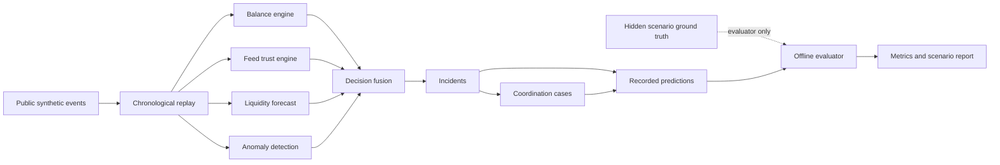

# Validation Evidence

## Super Agent Liquidity & Risk Intelligence Platform

This document presents measured validation evidence from the deterministic synthetic replay used by the prototype. The challenge requires at least three measured metrics covering analytics, system performance, or reliability. This report provides evidence across all three categories.

> **Scope statement:** These results were measured on the project’s deterministic synthetic scenario set. They demonstrate the behaviour of the prototype under controlled test conditions. They are not claims of production fraud-detection accuracy or production-scale performance.

---

## 1. Validation objective

The validation process answers five questions:

1. Does the analytical engine detect the injected unusual-activity scenarios?
2. Does it avoid escalating the legitimate-demand hard negative?
3. Does it detect delayed, missing, recovered, or conflicting provider data?
4. Does it convert important incidents into explainable, traceable coordination cases?
5. Can the complete replay pipeline process the demonstrated event volume responsively?

---

## 2. Evaluated run

| Field | Measured value |
|---|---:|
| Run ID | `DEMO-DAY-V2` |
| Deterministic seed | `20260711` |
| Public transactions | `1,173` |
| Total replayed events | `2,144` |
| Full replay duration | `8.7786 seconds` |
| Evaluation mode | Offline shadow replay |
| Ground truth | Evaluator-only hidden scenario labels |

The evaluator replayed the same public event stream through the same balance, data-trust, liquidity, anomaly, fusion, incident, and case engines used by the live API.

Hidden `scenario_id` labels were loaded only after public-event processing. They were not supplied to the operational engines.

---

## 3. Validation pipeline



---

# 4. Headline measured metrics

The following metrics satisfy the requirement for measured analytical, performance, and reliability evidence.

| Category | Metric | Result | Target | Status |
|---|---|---:|---:|---|
| Analytics | Anomaly precision | **100%** | ≥ 80% | Pass |
| Analytics | Anomaly recall | **100%** | ≥ 80% | Pass |
| Analytics | Hard-negative false-positive rate | **0%** | ≤ 20% | Pass |
| Reliability | Data-quality detection coverage | **100%** | 100% | Pass |
| Reliability | Liquidity detection coverage | **100%** | 100% | Pass |
| Explainability | Incident explanation coverage | **100%** | ≥ 95% | Pass |
| Coordination | Incident-to-case coverage | **100%** | ≥ 95% | Pass |
| Performance | Average event-processing latency | **3.408 ms** | Informational | Pass |
| Performance | P95 event-processing latency | **4.753 ms** | ≤ 250 ms | Pass |
| Forecast timing | Shortage lead time | **0.0 min** | > 0 min | Warning |

---

# 5. Metric definitions and interpretation

## 5.1 Anomaly precision — 100%

### Definition

```text
true positive review detections
--------------------------------
all review detections
```

### Result

```text
1.000 = 100%
Target: at least 80%
Status: PASS
```

### Meaning

Every anomaly review detection counted by the evaluator corresponded to an intentionally injected positive scenario in this synthetic run.

### Why this matters

High precision reduces unnecessary operational escalation and supports the challenge requirement to acknowledge false-positive risk.

### Boundary

This value applies only to the controlled synthetic scenario catalogue. It does not prove 100% precision on real provider data.

---

## 5.2 Anomaly recall — 100%

### Definition

```text
detected injected anomaly scenarios
-----------------------------------
all injected anomaly scenarios
```

### Result

```text
1.000 = 100%
Target: at least 80%
Status: PASS
```

### Meaning

All anomaly scenarios included in the evaluator’s positive set were detected during the replay.

### Why this matters

Recall shows that the system did not miss the unusual-activity behaviours it was explicitly designed to detect, including repeated or near-identical amounts, account concentration, and cross-provider linked activity.

### Boundary

The scenario set is finite and intentionally designed. Additional behaviours and temporal holdouts would be required before any production claim.

---

## 5.3 Hard-negative false-positive rate — 0%

### Definition

```text
legitimate hard-negative scenarios incorrectly requiring review
---------------------------------------------------------------
all evaluated legitimate hard-negative scenarios
```

### Result

```text
0.000 = 0%
Target: no more than 20%
Status: PASS
```

### Meaning

The legitimate Eid-demand scenario did not incorrectly require risk review.

### Why this matters

The challenge explicitly requires the system to distinguish possible legitimate demand spikes from patterns that require review. This metric demonstrates that high transaction volume alone does not automatically become a risk accusation.

### Important nuance

The scenario correctly avoided a false review, but its final classification remained `NORMAL_ACTIVITY` rather than the intended explicit `LEGITIMATE_DEMAND_SPIKE` category. This is documented later as a remaining classification issue.

---

## 5.4 Data-quality detection coverage — 100%

### Definition

```text
detected feed-delay, recovery, and balance-conflict checks
---------------------------------------------------------
all injected data-quality checks
```

### Result

```text
1.000 = 100%
Target: 100%
Status: PASS
```

### Meaning

The replay detected the provider-feed degradation/recovery scenario and the reported-versus-calculated balance conflict.

### Observed examples

- Rocket feed degradation was detected and later recovered to `HEALTHY`.
- The bKash balance-conflict scenario detected:
  - reported balance: `225,000`
  - calculated balance: `190,650`
  - difference: `34,350`

### Why this matters

Missing, late, or conflicting data must not silently produce confident recommendations. This coverage shows that the platform recognizes these reliability failures as operational conditions.

---

## 5.5 Liquidity detection coverage — 100%

### Definition

```text
detected injected provider-liquidity scenarios
----------------------------------------------
all injected provider-liquidity scenarios
```

### Result

```text
1.000 = 100%
Target: 100%
Status: PASS
```

### Meaning

The hidden provider-shortage scenario was detected while the shared-cash state remained healthier than the affected provider position.

### Observed timing

- Expected detection point: `12:08:00`
- First detected: `12:04:06`
- Detection relative to expected point: `3.9 minutes earlier`

### Why this matters

This is the core multi-provider value proposition: an outlet may look healthy in aggregate while one provider-specific e-money position is already under pressure.

### Important nuance

The separate `shortage_lead_time` metric remained `0.0 minutes`, so the final frozen submission should improve or redefine that calculation before claiming positive operational lead time.

---

## 5.6 Incident explanation coverage — 100%

### Definition

```text
incidents containing reason, evidence, uncertainty, and safe next step
---------------------------------------------------------------------
all generated incidents
```

### Result

```text
1.000 = 100%
Target: at least 95%
Status: PASS
```

### Meaning

Every generated incident included the structured information needed for explainable human decision support.

### Why this matters

The challenge requires high-impact alerts to expose why they were raised, what evidence supports them, and what uncertainty remains.

---

## 5.7 Incident-to-case coverage — 100%

### Definition

```text
incidents linked to traceable coordination cases
-------------------------------------------------
all generated incidents
```

### Result

```text
1.000 = 100%
Target: at least 95%
Status: PASS
```

### Meaning

Every generated incident was connected to a coordination case rather than ending as a passive dashboard alert.

### Why this matters

This validates the complete operational chain:

```text
analytical signal
→ incident
→ receiver
→ owner
→ acknowledgement
→ review
→ resolution or escalation
```

---

## 5.8 Average event-processing latency — 3.408 ms

### Definition

Mean complete-pipeline processing time for one replayed event.

### Result

```text
3.408 milliseconds per event
Status: PASS / informational
```

### Meaning

Across the demonstrated replay volume, the average event passed through the complete analytical pipeline in a few milliseconds.

### Boundary

This is process-local prototype performance on the test machine. It does not include internet latency, a production database, distributed messaging, or multi-node coordination.

---

## 5.9 P95 event-processing latency — 4.753 ms

### Definition

The event-processing time below which 95% of replayed events completed.

### Result

```text
4.753 milliseconds
Target: at most 250 milliseconds
Status: PASS
```

### Meaning

Ninety-five percent of the 2,144 replayed events completed the core pipeline within 4.753 ms.

### Why P95 is included

Average latency alone can hide slow events. P95 gives evidence that nearly the entire demonstrated event set remained responsive.

---

# 6. Public-data and financial invariants

Before analytical metrics were accepted, the evaluator checked the integrity of the public dataset.

| Invariant | Observed result | Status |
|---|---|---|
| Hidden ground-truth leakage | No hidden scenario fields in public transactions | Pass |
| Unique transaction IDs | 1,173 unique IDs out of 1,173 transactions | Pass |
| Chronological transaction ordering | Valid chronological stream | Pass |
| Hidden-label references | Every label refers to a public transaction | Pass |
| Financial invariants | No unexplained negative financial balances | Pass |

These checks matter because high analytical scores would not be credible if the detector could read the hidden labels or if the simulated financial state were inconsistent.

---

# 7. Scenario-level evidence

| Scenario | Expected behaviour | First detection | Result |
|---|---|---:|---|
| Hidden provider shortage | Provider pressure while shared cash remains healthier | 12:04:06 | Pass |
| Repeated cash-out cluster | Near-identical amounts, account concentration, human review | 13:52:05 | Pass |
| Feed delay and recovery | Feed degrades and later returns to healthy | 13:00:00 | Pass |
| Legitimate demand spike | No false risk review and explicit demand-spike category | Not classified as intended | Partial |
| Balance conflict | Reported and calculated balances conflict | 15:20:58 | Pass |
| Cross-provider linked activity | Related cross-provider factor requires review | 16:02:30 | Pass |

---

# 8. Current validation status and transparent limitations

The current baseline report records:

```text
overall_status: FAIL
```

This does **not** mean the full analytical pipeline failed. It means the strict evaluator still contains one failed scenario-classification check and one warning metric.

## 8.1 Legitimate-demand category mismatch

### What passed

The legitimate Eid-demand scenario did **not** require risk review.

### What did not pass

The final category was:

```text
NORMAL_ACTIVITY
```

instead of:

```text
LEGITIMATE_DEMAND_SPIKE
```

### Interpretation

The false-positive safety behaviour worked, but the context-aware category was not retained in the final snapshot.

### Submission action

Before freezing the final report, either:

1. retain the context category for the intended evaluation window, or
2. change the evaluator to measure whether the category appeared during the active scenario window rather than only in the final snapshot.

---

## 8.2 Shortage lead-time warning

### Result

```text
0.0 minutes
Target: greater than 0 minutes
Status: WARNING
```

### Interpretation

The scenario was detected, but the dedicated lead-time calculation did not demonstrate positive time remaining before depletion.

### Submission action

Before freezing the final report:

1. confirm the definition of actual depletion time,
2. record the forecast at first pressure detection,
3. compute lead time from that first detection,
4. preserve the first valid forecast rather than reading only the final state,
5. rerun the deterministic evaluator.

---

## 8.3 Final-snapshot versus first-detection mismatch

Several scenario checks passed when the behaviour first appeared, while later observations returned to normal because the analytics use rolling windows.

This is expected for transient operational behaviour, but the report should separate:

```text
first qualifying observation
peak observation
final observation
```

The final submission report should show all three so that a cleared incident is not mistaken for a missed incident.

---

# 9. Reproduction commands

Run the deterministic validator:

```bash
python scripts/validate_simulation_v2.py
```

Run the key integration test:

```bash
pytest tests/integration/test_simulation_shadow_replay.py -v
```

Run scenario-generation tests:

```bash
pytest tests/unit/test_simulation_scenarios.py -v
```

Run the full suite:

```bash
pytest -v
```

Recommended final evidence capture:

```bash
mkdir -p artifacts/validation

python scripts/validate_simulation_v2.py   | tee artifacts/validation/validator-output.txt

pytest -v   | tee artifacts/validation/pytest-output.txt
```

Preserve the generated JSON report:

```text
artifacts/validation/simulation_v2_report.json
```

---

# 10. Evidence files for submission

The final repository should include:

```text
artifacts/validation/
├── simulation_v2_report.json
├── metrics_summary.csv
├── validator-output.txt
├── pytest-output.txt
└── validation-screenshot.png
```

This document should be stored as:

```text
docs/VALIDATION_EVIDENCE.md
```

---

# 11. Recommended presentation metrics

For the final presentation, use these five headline metrics:

```text
Anomaly precision                    100%
Anomaly recall                       100%
Hard-negative false-positive rate      0%
Data-quality detection coverage      100%
P95 event-processing latency       4.753 ms
```

Add the following caption directly below them:

> Measured on a deterministic synthetic scenario set containing 1,173 public transactions and 2,144 replayed events. These results validate the prototype under controlled conditions and are not production accuracy claims.

Do not present the current report as fully passed until the legitimate-demand classification check and shortage lead-time warning are resolved or explicitly accepted as documented limitations.

---

# 12. Final validation statement

The baseline evidence demonstrates that the prototype:

- detected all evaluator-counted anomaly scenarios,
- avoided a false risk-review escalation on the legitimate-demand hard negative,
- detected the injected provider-feed and balance-quality problems,
- detected the hidden provider-liquidity scenario,
- attached structured explanations to all incidents,
- linked all incidents to traceable cases,
- and processed 95% of replayed events within 4.753 ms.

The remaining work is narrow and measurable: preserve the legitimate-demand category during its active window and produce a positive, correctly defined shortage lead-time measurement before freezing the final submission report.
